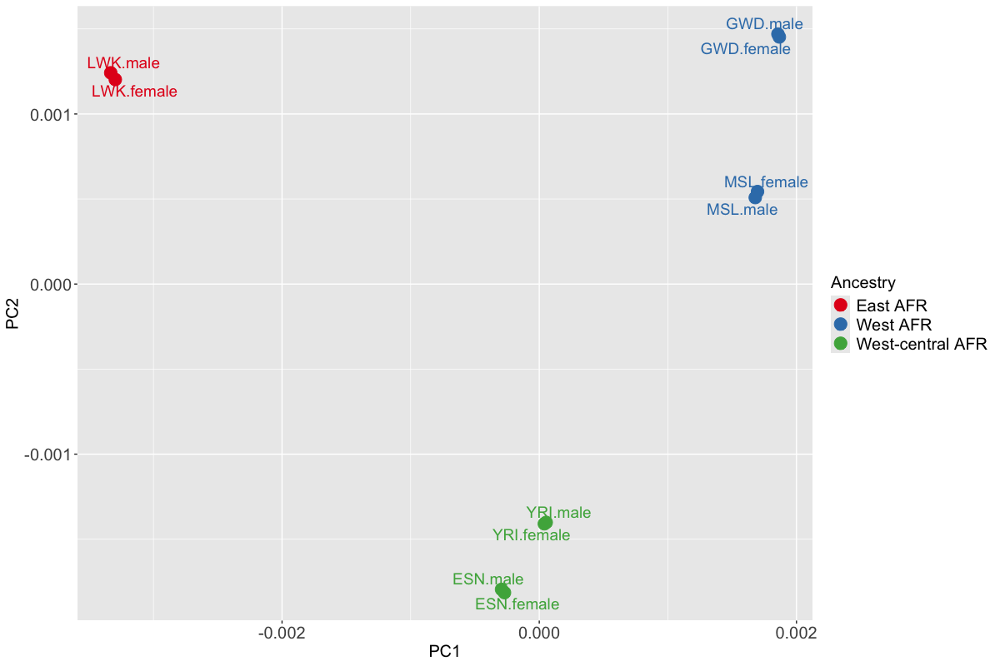

# envMRMEGAfm: environment-adjusted MR-MEGA Fine-mapping

## Introduction

The R package **envMRMEGAfm** (env-MR-MEGA fine-mapping) is designed for
simultaneously fine-mapping genetic associations across multiple
cohorts, allowing for multiple causal variants. This method only
requires cohort-level summary statistics, the corresponding linkage
disequilibrium (LD) matrices, and optionally, cohort-level environmental
covariates (e.g. mean or proportion). Sometimes, we are unable to obtain
LD from each cohort. In such cases, we can estimate LD structure using
reference panels, such as 1000 Genomes ([Consortium et al.
2015](#ref-10002015global)), from a genetically similar population to
the GWAS. This method is powerful, versatile and computationally fast in
pinpointing potential causal variants while accounting for differing
environmental exposures that are specific to each cohort, in addition to
ancestry.

Accounting for environmental exposures that differ between cohorts and
likely impact the variability of traits, the R package **envMRMEGAfm**
introduces MR-MEGAfm and env-MR-MEGAfm, building upon MR-MEGA ([Mägi et
al. 2017](#ref-magi2017trans)) and env-MR-MEGA ([Wang et al.
2024](#ref-wang2024accounting)) meta-regression frameworks. In addition
to the two key fine-mapping methods, **envMRMEGAfm** package also
includes the method for estimating conditional and joint genetic variant
effects, which was proposed in GCTA ([Yang et al.
2012](#ref-yang2012conditional)) and the meta-analysis approaches,
[MR-MEGA](https://genomics.ut.ee/en/tools/) ([Mägi et al.
2017](#ref-magi2017trans)) and
[env-MR-MEGA](https://SiruRooney.github.io/env.MRmega/) ([Wang et al.
2024](#ref-wang2024accounting)).

The main R functions in this package are:

1.  `env_MR_MEGA_fm`:A **fine-mapping** approach applicable across
    multiple cohorts, with the flexibility to account for both ancestral
    and environmental effects (env-MR-MEGAfm) or only ancestral effects
    (MR-MEGAfm).

2.  `MR_mega_run`: The (environment-adjusted) MR-MEGA meta-regression
    model.

3.  `meta_sel_condest`: The approximate conditional genetic effects
    method.

4.  `meta_sel_joinest`: The approximate joint genetic effects method.

This vignette guides readers in fine-mapping the genetic associations
for a trait across multiple cohorts using MR-MEGAfm and env-MR-MEGAfm.
For convenience of illustration, a simulated dataset is provided in the
**envMRMEGAfm** package and details of how to run (env-)MR-MEGAfm method
on your own data are explained.

## Preparation for (env-)MR-MEGAfm

Before running the (env-)MR-MEGAfm method, several input files need to
be prepared. Each input file must also include mandatory columns about
genetic variants.

### Input data and format requirements

The (env-)MR-MEGAfm starts with a model with the most significant SNP in
the single-SNP meta-analysis with P value below the genome-wide
significant level $`5\times 10^{-8}`$. Therefore, it is required that
the single-SNP meta-analysis are conducted by MR-MEGA ([Mägi et al.
2017](#ref-magi2017trans)) and env-MR-MEGA ([Wang et al.
2024](#ref-wang2024accounting)). It is noted that the meta-analysis
results from both MR-MEGA and env-MR-MEGA can be obtained from
`MR_mega_lrw` and `MR_mega_env_lrw`, which are wrapper functions in the
**env.MRmega** R package.

For an overview of **env.MRmega** R package, see
[env.MRmega](https://SiruRooney.github.io/env.MRmega/) GitHub page.

1.  A list of GWAS files is required for conducting both the
    meta-analysis and the following fine-mapping methods. The format of
    each file has mandatory column headers, as in the
    [MR-MEGA](https://genomics.ut.ee/en/tools/) software :

- `MARKERNAME` - snp name
- `N` - sample size
- `EAF` - effect allele frequency
- `EA` - effect allele
- `NEA` - non effect allele
- `CHROMOSOME` - chromosome of marker
- `POSITION` - position of marker
- `BETA` - beta
- `SE` - std.error

2.  When fitting the (env-)MR-MEGA model and running (env-)MR-MEGAfm
    method, we need to prepare the axes of genetic variation (PCs) and
    the cohort-level environment exposures. If PCs are not available,
    `MR_mega_MDS` R function implemented in
    [env.MRmega](https://SiruRooney.github.io/env.MRmega/) package is
    used for calculating PCs by inputting the file containing all GWAS
    files location and the number of PCs.

3.  The meta-analysis results, as the second required file, can be
    obtained from either [MR-MEGA](https://genomics.ut.ee/en/tools/)
    software or [env.MRmega](https://SiruRooney.github.io/env.MRmega/)
    package. The output from both approaches must contain the following
    columns.

- `MARKERNAME`: unique marker identification across all cohorts.

- `CHROMOSOME`: chromosome of marker.

- `POSITION`: physical position in chromosome of marker.

- `N`: sample size.

- `chisq_association`, `ndf_association` and `pvalue_association`: test
  of the null hypothesis of no association of each variant. `chisq_`,
  `ndf_` and `pvalue_` refer to chisq value, number of degrees of
  freedom and p-values of the corresponding test.

4.  In addition to the list of GWAS files and the corresponding
    meta-analysis results, the (env-)MR-MEGAfm method requires the
    cohort-level LD correlation matrices as a third input file. When the
    cohort-level LD correlation is unavailable, an approximation of the
    LD correlation matrix based on a reference panel may be used. For
    each LD correlation structure, both the column names and row names
    correspond to `MARKERNAME`.

### Packages installation and loading

Before installing **envMRMEGAfm** package, we load the packages
necessary for analysis, and check the version of each package.

``` r
#cran
cran.pkgs <- c('data.table', 'doParallel','dplyr','foreach','parallel')

# load packages 
sapply(cran.pkgs, require, character.only = TRUE)
```

## Simulation example

In this simulated data example, we considered 5 continental African
populations which were collected from Phase 3 of the 1000 Genomes
Project ([Consortium et al. 2015](#ref-10002015global)). The five
populationss are coded as ESN, GWD, LWK, MSL, YRI. Using the genotype
data from each of the five cohorts, we used
[HAPGEN2](https://mathgen.stats.ox.ac.uk/genetics_software/hapgen/hapgen2.html)
([Su, Marchini, and Donnelly 2011](#ref-su2011hapgen2)) software to
generate individual-level genotype data of each cohort, with a sample
size of 10,000 for each cohort. Within each population, we retained
variants with MAF\>0.01, regardless of whether the variant satisfies the
MAF threshold in the other African populations. Under this setting, the
number of retained variants differs across populations: 301 in ESN, 291
in GWD, 289 in LWK, 299 in MSL and 292 in YRI. Each populations is then
stratified into female and male cohorts. When simulating 10
sex-stratified GWAS files for a region in chromosome19:
45711510-45770083, two randomly selected genetic variants, rs73939822
and rs60269219, were designed as causal variants (CVs) across all
cohorts. Additionally, the corresponding population-level LD correlation
matrices are calculated and can be loaded from the **envMRMEGAfm**
package.

Fig 1 shows that the first two axes of genetic variation from
multi-dimensional scaling of the Euclidean distance matrix between 10
sex-stratified cohorts are sufficient to separate population groups from
different regions of Africa: east Africa (LWK), west-central Africa
(ESN,YRI) and west Africa (GWD, MSL).

``` r


```


Figure 1. Axes of genetic variation separating five continental African
cohorts

Accounting for sex indicators and environmental exposures which differ
across all cohorts, we introduce sex and smoking status as the two
environmental covariates. Cohort-level environmental covariates are
constructed by taking the mean or proportion of each individual-level
covariate. Cohort-level sex and smoking covariates can be loaded using
the following codes:

``` r
library(envMRMEGAfm)
data(sexsmk)
sexsmk
#>    sex  smoke
#> 1    1 0.2120
#> 2    0 0.8314
#> 3    1 0.1890
#> 4    0 0.6750
#> 5    1 0.2332
#> 6    0 0.8014
#> 7    1 0.2652
#> 8    0 0.6554
#> 9    1 0.2608
#> 10   0 0.8810
```

For simulating the (environment-adjusted) meta-analysis results, we
derived two axes of genetic variation (PCs) from a subset of variant
with MAF\>5% in across 10 sex-stratified African cohorts. The PCs can be
loaded from **envMRMEGAfm** package and are shown in the following:

``` r
library(envMRMEGAfm)
data(pcs)
pcs
#>               V1           V2
#> 1  -0.0035230264 -0.027745304
#> 2  -0.0038187733 -0.027451544
#> 3   0.0243106090  0.022216813
#> 4   0.0241666027  0.022483699
#> 5  -0.0429318096  0.018390796
#> 6  -0.0433946312  0.018995055
#> 7   0.0221012729  0.008319361
#> 8   0.0218724163  0.007775967
#> 9   0.0005143428 -0.021555609
#> 10  0.0007029969 -0.021429234
```

Note: - If PCs are not available, `MR_mega_MDS` function implemented in
[env.MRMEGA](https://SiruRooney.github.io/env.MRmega/) package is used
for calculating PCs by inputting the file containing all GWAS files
location and the number of PCs.

### Data pre-processing

In **envMRMEGAfm** package, R function `env_MR_MEGA_fm` is the main tool
for fine-mapping genetic associations for the specified traits. Before
performing the fine-mapping procedure, we need to make sure that all
GWAS and LD matrices are aligned to the same reference allele.
Additionally, some large-scaled LD matrices might contain redundant
variants that are not present in all GWAS files. Through data
pre-processing, we simplify the raw LD data by removing these redundant
variants.

In practice, since both GWAS files and LD matrices contain a large
amount of genetic variants information, we need to create two input
files: one for all GWAS files locations and another for LD matrices
locations. The `read_gwasld` function is used for pre-processing these
raw data.

``` r
gwas.loc=c("/Volumes/Mac/Stepwise_conditioning/Codes/env-MR-MEGAfm-Rpack/g1000_5afr_Rpack/gwasfile/esn_female.txt",
           "/Volumes/Mac/Stepwise_conditioning/Codes/env-MR-MEGAfm-Rpack/g1000_5afr_Rpack/gwasfile/esn_male.txt",
           "/Volumes/Mac/Stepwise_conditioning/Codes/env-MR-MEGAfm-Rpack/g1000_5afr_Rpack/gwasfile/gwd_female.txt",
           "/Volumes/Mac/Stepwise_conditioning/Codes/env-MR-MEGAfm-Rpack/g1000_5afr_Rpack/gwasfile/gwd_male.txt",
           "/Volumes/Mac/Stepwise_conditioning/Codes/env-MR-MEGAfm-Rpack/g1000_5afr_Rpack/gwasfile/lwk_female.txt",
           "/Volumes/Mac/Stepwise_conditioning/Codes/env-MR-MEGAfm-Rpack/g1000_5afr_Rpack/gwasfile/lwk_male.txt",
           "/Volumes/Mac/Stepwise_conditioning/Codes/env-MR-MEGAfm-Rpack/g1000_5afr_Rpack/gwasfile/msl_female.txt",
           "/Volumes/Mac/Stepwise_conditioning/Codes/env-MR-MEGAfm-Rpack/g1000_5afr_Rpack/gwasfile/msl_male.txt",
           "/Volumes/Mac/Stepwise_conditioning/Codes/env-MR-MEGAfm-Rpack/g1000_5afr_Rpack/gwasfile/yri_female.txt",
           "/Volumes/Mac/Stepwise_conditioning/Codes/env-MR-MEGAfm-Rpack/g1000_5afr_Rpack/gwasfile/yri_male.txt")

ld.loc=c("/Volumes/Mac/Stepwise_conditioning/Codes/env-MR-MEGAfm-Rpack/g1000_5afr_Rpack/LD/esn.txt",
         "/Volumes/Mac/Stepwise_conditioning/Codes/env-MR-MEGAfm-Rpack/g1000_5afr_Rpack/LD/gwd.txt",
         "/Volumes/Mac/Stepwise_conditioning/Codes/env-MR-MEGAfm-Rpack/g1000_5afr_Rpack/LD/lwk.txt",
         "/Volumes/Mac/Stepwise_conditioning/Codes/env-MR-MEGAfm-Rpack/g1000_5afr_Rpack/LD/msl.txt",
         "/Volumes/Mac/Stepwise_conditioning/Codes/env-MR-MEGAfm-Rpack/g1000_5afr_Rpack/LD/yri.txt")

LD=c("esn","gwd","lwk","msl","yri")
#Each African population is stratified into male and female cohorts.
pop=c("esn.female","esn.male","gwd.female","gwd.male","lwk.female","lwk.male","msl.female","msl.male","yri.female","yri.male")

gwasld=read_gwasld(gwas.loc,ld.loc,which.ld=rep(LD,each=2),cohort_name=pop,ld_name=LD,out_loc=NULL)
#> [1] "i in filesize 1"
#> [1] "Reading gwas file /Volumes/Mac/Stepwise_conditioning/Codes/env-MR-MEGAfm-Rpack/g1000_5afr_Rpack/gwasfile/esn_female.txt"
#> There are  301  SNPs in this GWAS file
#> [1] "i in filesize 2"
#> [1] "Reading gwas file /Volumes/Mac/Stepwise_conditioning/Codes/env-MR-MEGAfm-Rpack/g1000_5afr_Rpack/gwasfile/esn_male.txt"
#> There are  301  SNPs in this GWAS file
#> [1] "i in filesize 3"
#> [1] "Reading gwas file /Volumes/Mac/Stepwise_conditioning/Codes/env-MR-MEGAfm-Rpack/g1000_5afr_Rpack/gwasfile/gwd_female.txt"
#> There are  291  SNPs in this GWAS file
#> [1] "i in filesize 4"
#> [1] "Reading gwas file /Volumes/Mac/Stepwise_conditioning/Codes/env-MR-MEGAfm-Rpack/g1000_5afr_Rpack/gwasfile/gwd_male.txt"
#> There are  291  SNPs in this GWAS file
#> [1] "i in filesize 5"
#> [1] "Reading gwas file /Volumes/Mac/Stepwise_conditioning/Codes/env-MR-MEGAfm-Rpack/g1000_5afr_Rpack/gwasfile/lwk_female.txt"
#> There are  289  SNPs in this GWAS file
#> [1] "i in filesize 6"
#> [1] "Reading gwas file /Volumes/Mac/Stepwise_conditioning/Codes/env-MR-MEGAfm-Rpack/g1000_5afr_Rpack/gwasfile/lwk_male.txt"
#> There are  289  SNPs in this GWAS file
#> [1] "i in filesize 7"
#> [1] "Reading gwas file /Volumes/Mac/Stepwise_conditioning/Codes/env-MR-MEGAfm-Rpack/g1000_5afr_Rpack/gwasfile/msl_female.txt"
#> There are  299  SNPs in this GWAS file
#> [1] "i in filesize 8"
#> [1] "Reading gwas file /Volumes/Mac/Stepwise_conditioning/Codes/env-MR-MEGAfm-Rpack/g1000_5afr_Rpack/gwasfile/msl_male.txt"
#> There are  299  SNPs in this GWAS file
#> [1] "i in filesize 9"
#> [1] "Reading gwas file /Volumes/Mac/Stepwise_conditioning/Codes/env-MR-MEGAfm-Rpack/g1000_5afr_Rpack/gwasfile/yri_female.txt"
#> There are  292  SNPs in this GWAS file
#> [1] "i in filesize 10"
#> [1] "Reading gwas file /Volumes/Mac/Stepwise_conditioning/Codes/env-MR-MEGAfm-Rpack/g1000_5afr_Rpack/gwasfile/yri_male.txt"
#> There are  294  SNPs in this GWAS file
#> [1] "i in filesize 1"
#> [1] "Reading LD file /Volumes/Mac/Stepwise_conditioning/Codes/env-MR-MEGAfm-Rpack/g1000_5afr_Rpack/LD/esn.txt"
#> [1] 301 301
#> [1] "i in filesize 2"
#> [1] "Reading LD file /Volumes/Mac/Stepwise_conditioning/Codes/env-MR-MEGAfm-Rpack/g1000_5afr_Rpack/LD/gwd.txt"
#> [1] 291 291
#> [1] "i in filesize 3"
#> [1] "Reading LD file /Volumes/Mac/Stepwise_conditioning/Codes/env-MR-MEGAfm-Rpack/g1000_5afr_Rpack/LD/lwk.txt"
#> [1] 289 289
#> [1] "i in filesize 4"
#> [1] "Reading LD file /Volumes/Mac/Stepwise_conditioning/Codes/env-MR-MEGAfm-Rpack/g1000_5afr_Rpack/LD/msl.txt"
#> [1] 299 299
#> [1] "i in filesize 5"
#> [1] "Reading LD file /Volumes/Mac/Stepwise_conditioning/Codes/env-MR-MEGAfm-Rpack/g1000_5afr_Rpack/LD/yri.txt"
#> [1] 293 293
#> [1] "Assign each GWAS file to the corresponding LD structure......"
#> [1] "matrix" "array" 
#> [1] 301 301
#> [1] "matrix" "array" 
#> [1] 291 291
#> [1] "matrix" "array" 
#> [1] 289 289
#> [1] "matrix" "array" 
#> [1] 299 299
#> [1] "matrix" "array" 
#> [1] 293 293

gwas.list=gwasld$gwas.list

ld.list=gwasld$ld.list
```

In the commands above, `read_gwasld` function outputs two files: one
containing the pre-processed GWAS files and another containing the
pre-processed LD matrices. These pre-processed GWAS files and LD
matrices can be loaded from the **envMRMEGAfm** package.

More specifically, the above arguments present in `read_gwasld` function
are:

- `gwas.loc`: A file contains a vector of length $`K_g`$. Each component
  of the vector refers to the location of GWAS file.

- `ld.loc`: A file contains a vector of length $`K_{ld}`$. Each
  component of the vector refers to the location of LD structure files.

- `which.ld`: A character vector of length $`K_g`$. Each component of
  the vector corresponds to one LD structure. The length of which.ld
  should equal to the number of GWAS files. Note: the argument
  `which.ld` is regarded as a link between GWAS files and LD files. Each
  component of `which.ld` vector results from one of the LD names.

- `cohort_name`: A character vector of length $`K_g`$. Each component of
  the vector corresponds to one GWAS file.

- `ld_name`: A character vector of length $`K_{ld}`$. Each component of
  the vector corresponds to one LD structure.

- `out_loc`: Path to save pre-processed GWAS files and LD structure. By
  default, `out_loc`=NULL.

- `actual.geno`: An indicator to specify whether the true cohort-level
  LD structure is provided. If we can obtain the real cohort-level LD
  structures directly or derive LD structures from the real
  individual-level genotype data of the involved cohorts, the argument
  `actual.geno` is set to `TRUE`. If we estimate LD approximation from
  the reference sample as a replacement, `actual.geno` is set to
  `FALSE`. By default `actual.geno`=FALSE.The default value is
  consistent for GCTA-COJO setting.

### Fine-mapping

In the simulation design where the allelic heterogeneity is correlated
with smoking status, we applied env-MR-MEGAfm method and MR-MEGAfm to
the simulated example respectively. Different from env-MR-MEGAfm, we run
MR-MEGAfm by setting the argument `env` as `NULL`. In addition to some
arguments appearing in `read_gwasld` function, there are other arguments
in `env_MR_MEGA_fm` function. The additional arguments are illustrated
in the following:

- `meta.file`: The meta-analysis results obtained from the output of
  MR-MEGA method or env-MR-MEGA method. A dataframe contains some
  mandatory columns where **Preparation for (env-)MR-MEGAfm** section
  gives the further details.

- `ncores`: The number of cores which would be used for running in
  parallel.

- `collinear`: A correlation threshold to filter out the target SNP in
  high LD with the SNP set. If the squared multiple correlation between
  the target SNP exceeds the threshold, such as 0.9, the target SNP is
  ignored.

- `pvalue_cutoff`: A p-value threshold to identify genetic associations.
  By default, `pvalue_cutoff`=5e-8.

- `cred.thr`: Credible threshold for the credible set for each selected
  potential SNP. By default, `cred.thr`=0.99 refers to 99% credible
  sets.

Note:

- In this simulated example, LD correlation matrix of each population
  was derived from the true individual-level genotype data, with the
  argument `actual.geno` set to `TRUE`. However, in some cases,
  individual-level genotype data for each cohort are poor, resulting in
  unavailable for calculation of LD matrices. In such cases, the LD
  matrix can be estimated using a reference panel (e.g. [1000
  Genomes](https://ctg.cncr.nl/software/MAGMA/ref_data/)) from a
  genetically similar population to the samples used for
  genotype-phenotype association analysis. When the approximation of LD
  matrix is applied, argument `actual.geno` should be set to `FALSE`.

- For (env-)MR-MEGAfm method, the key model selection strategy is built
  upon (env-)MR-MEGA meta-analysis framework. As a result,
  (env-)MR-MEGAfm method has the limitations regarding the number of PCs
  (T) and the number of environment exposures (K). Specifically, for
  MR-MEGAfm, across (K) cohorts, the number of axes of genetic variation
  (T) is constrained by T\<K-2. For env-MR-MEGAfm, the limitation
  extends to the sum of the number of axes of genetic variation (T) and
  the number of environmental covariates (S), with the limitation
  T+S\<K-2.

**env-MR-MEGAfm**

``` r
names(gwas.list)
#>  [1] "esn.female" "esn.male"   "gwd.female" "gwd.male"   "lwk.female"
#>  [6] "lwk.male"   "msl.female" "msl.male"   "yri.female" "yri.male"
names(ld.list)
#> [1] "esn" "gwd" "lwk" "msl" "yri"

######################################env-MR-MEGA fine-mapping###################################
tictoc::tic("Run env-MR-MEGA fine-mapping method")
library(doParallel)
#> Loading required package: foreach
#> Loading required package: iterators
#> Loading required package: parallel
class(sexsmk)
#> [1] "data.frame"
class(pcs)
#> [1] "data.frame"
envmetafm.out=env_MR_MEGA_fm(gwas.list,ld.list,which.ld=rep(names(ld.list),each=2),meta.file=envMRMEGAout,PCs=pcs,env=sexsmk,out_loc=NULL,ncores=2,collinear=0.9,pvalue_cutoff=5e-8,cred.thr=0.99)
#> (Collinearity cutoff =  0.9 )
#> The number of cores are  2 , which are used for running in parallel
#> The threshold for credible set is set to  0.99 .
#> At the  1 iteration, the set of the selected SNPs include 
#> [1] "rs73939822"
#> [1] "All GWAS are assigned to the same reference allele"
#> [1] "At the same, the correponding LD structures should be adjusted accordingly."
#> Linear regression model for each genetic variant, and the number of cores are  2 
#> At the  2 iteration, the set of the selected SNPs include 
#> [1] "rs73939822" "rs60269219"
#> The target selected genetic variant is rs73939822 
#> [1] "All GWAS are assigned to the same reference allele"
#> [1] "At the same, the correponding LD structures should be adjusted accordingly."
#> Linear regression model for each genetic variant, and the number of cores are  2 
#> Linear regression model for each genetic variant, and the number of cores are  2 
#> The target selected genetic variant is rs60269219 
#> [1] "All GWAS are assigned to the same reference allele"
#> [1] "At the same, the correponding LD structures should be adjusted accordingly."
#> Linear regression model for each genetic variant, and the number of cores are  2 
#> Linear regression model for each genetic variant, and the number of cores are  2 
#> [1] "All GWAS are assigned to the same reference allele"
#> [1] "At the same, the correponding LD structures should be adjusted accordingly."
#> Linear regression model for each genetic variant, and the number of cores are  2 
#> There are  2  potential associated SNPs! 
#> The target selected genetic variant is rs73939822 
#> [1] "All GWAS are assigned to the same reference allele"
#> [1] "At the same, the correponding LD structures should be adjusted accordingly."
#> Linear regression model for each genetic variant, and the number of cores are  2 
#> Linear regression model for each genetic variant, and the number of cores are  2 
#> The target selected genetic variant is rs60269219 
#> [1] "All GWAS are assigned to the same reference allele"
#> [1] "At the same, the correponding LD structures should be adjusted accordingly."
#> Linear regression model for each genetic variant, and the number of cores are  2 
#> Linear regression model for each genetic variant, and the number of cores are  2
tictoc::toc()
#> Run env-MR-MEGA fine-mapping method: 28.969 sec elapsed
envmetafm.out
#> $sel.set
#> [1] "rs73939822" "rs60269219"
#> 
#> $tgCS.thr
#> $tgCS.thr$rs73939822
#>     MARKERNAME chisq_association ndf_association pvalue_association
#> 215 rs73939822          1972.823               5                  0
#>     chisq_anc_env_het ndf_chisq_anc_env_het pvalue_anc_env_het chisq_residual
#> 215          424.8579                     4       1.181767e-90       6.102112
#>     ndf_residual pvalue_residual   logBF chisq_env_het ndf_env_het
#> 215            5       0.2964094 980.655      413.6669           2
#>     pvalue_env_het chisq_anc_het ndf_anc_het pvalue_anc_het       PPs maxld
#> 215   1.490651e-90      2.552803           2      0.2790396 0.9987435     1
#>     cs.inc
#> 215      1
#> 
#> $tgCS.thr$rs60269219
#>    MARKERNAME chisq_association ndf_association pvalue_association
#> 77 rs60269219          1701.090               5                  0
#> 76 rs61079153          1699.642               5                  0
#> 78 rs59356929          1691.853               5                  0
#>    chisq_anc_env_het ndf_chisq_anc_env_het pvalue_anc_env_het chisq_residual
#> 77          437.7434                     4       1.938165e-93       5.764427
#> 76          437.3153                     4       2.398521e-93       5.911945
#> 78          432.7377                     4       2.341041e-92       5.978292
#>    ndf_residual pvalue_residual    logBF chisq_env_het ndf_env_het
#> 77            5       0.3298202 844.7887      426.7314           2
#> 76            5       0.3148816 844.0645      426.5248           2
#> 78            5       0.3083369 840.1698      421.8789           2
#>    pvalue_env_het chisq_anc_het ndf_anc_het pvalue_anc_het         PPs maxld
#> 77   2.169937e-93      6.716531           2     0.03479557 0.666173442     1
#> 76   2.406172e-93      6.681750           2     0.03540597 0.322890947     1
#> 78   2.455613e-92      6.643331           2     0.03609267 0.006570714     1
#>    cs.inc
#> 77      1
#> 76      1
#> 78      1
```

**MR-MEGAfm**

``` r
######################################MR-MEGA fine-mapping###################################
tictoc::tic("Run env-MR-MEGA fine-mapping method")
library(doParallel)
metafm.out=env_MR_MEGA_fm(gwas.list,ld.list,which.ld=rep(names(ld.list),each=2),meta.file=MRMEGAout,PCs=pcs,env=NULL,out_loc=NULL,ncores=2,collinear=0.9,pvalue_cutoff=5e-8,cred.thr=0.99)
#> (Collinearity cutoff =  0.9 )
#> The number of cores are  2 , which are used for running in parallel
#> The threshold for credible set is set to  0.99 .
#> At the  1 iteration, the set of the selected SNPs include 
#> [1] "rs73939822"
#> [1] "All GWAS are assigned to the same reference allele"
#> [1] "At the same, the correponding LD structures should be adjusted accordingly."
#> Linear regression model for each genetic variant, and the number of cores are  2 
#> At the  2 iteration, the set of the selected SNPs include 
#> [1] "rs73939822" "rs60269219"
#> The target selected genetic variant is rs73939822 
#> [1] "All GWAS are assigned to the same reference allele"
#> [1] "At the same, the correponding LD structures should be adjusted accordingly."
#> Linear regression model for each genetic variant, and the number of cores are  2 
#> Linear regression model for each genetic variant, and the number of cores are  2 
#> The target selected genetic variant is rs60269219 
#> [1] "All GWAS are assigned to the same reference allele"
#> [1] "At the same, the correponding LD structures should be adjusted accordingly."
#> Linear regression model for each genetic variant, and the number of cores are  2 
#> Linear regression model for each genetic variant, and the number of cores are  2 
#> [1] "All GWAS are assigned to the same reference allele"
#> [1] "At the same, the correponding LD structures should be adjusted accordingly."
#> Linear regression model for each genetic variant, and the number of cores are  2 
#> There are  2  potential associated SNPs! 
#> The target selected genetic variant is rs73939822 
#> [1] "All GWAS are assigned to the same reference allele"
#> [1] "At the same, the correponding LD structures should be adjusted accordingly."
#> Linear regression model for each genetic variant, and the number of cores are  2 
#> Linear regression model for each genetic variant, and the number of cores are  2 
#> The target selected genetic variant is rs60269219 
#> [1] "All GWAS are assigned to the same reference allele"
#> [1] "At the same, the correponding LD structures should be adjusted accordingly."
#> Linear regression model for each genetic variant, and the number of cores are  2 
#> Linear regression model for each genetic variant, and the number of cores are  2
tictoc::toc()
#> Run env-MR-MEGA fine-mapping method: 25.029 sec elapsed

metafm.out
#> $sel.set
#> [1] "rs73939822" "rs60269219"
#> 
#> $tgCS.thr
#> $tgCS.thr$rs73939822
#>      MARKERNAME chisq_association ndf_association pvalue_association
#> 215  rs73939822          1559.156               3                  0
#> 222 rs143024846          1551.294               3                  0
#>     chisq_anc_het ndf_chisq_anc_het pvalue_anc_het chisq_residual ndf_residual
#> 215      11.19101                 2    0.003714517       419.7690            7
#> 222      10.05222                 2    0.006564303       414.2482            7
#>     pvalue_residual    logBF        PPs maxld cs.inc
#> 215    1.370481e-86 776.1242 0.98075059     1      1
#> 222    2.096064e-85 772.1933 0.01924941     1      1
#> 
#> $tgCS.thr$rs60269219
#>    MARKERNAME chisq_association ndf_association pvalue_association
#> 77 rs60269219          1274.359               3      5.387582e-276
#> 76 rs61079153          1273.117               3      1.001923e-275
#> 78 rs59356929          1269.974               3      4.818463e-275
#> 82 rs57294488          1268.921               3      8.154631e-275
#>    chisq_anc_het ndf_chisq_anc_het pvalue_anc_het chisq_residual ndf_residual
#> 77      11.01200                 2    0.004062321       432.4959            7
#> 76      10.79051                 2    0.004538063       432.4367            7
#> 78      10.85875                 2    0.004385831       427.8572            7
#> 82      10.98314                 2    0.004121372       428.0893            7
#>    pvalue_residual    logBF        PPs maxld cs.inc
#> 77    2.544181e-89 633.7256 0.58308761     1      1
#> 76    2.619670e-89 633.1047 0.31338763     1      1
#> 78    2.518646e-88 631.5329 0.06508363     1      1
#> 82    2.245652e-88 631.0064 0.03844113     1      1
```

The results from both MR-MEGAfm and env-MR-MEGAfm comprise two main
parts:

- `sel.set`: The selected potential associated SNP set.

- `tgCS.thr`: A list of the credible sets of the selected SNPs under the
  specified threshold. By default, the specified threshold is set to
  0.99. Each component of the list is a dataframe containing the
  following columns:

- `MARKERNAME`: unique marker identification across all cohorts.

- `chisq_association`, `ndf_association` and `pvalue_association`: test
  of the null hypothesis of no association of each variant. `chisq_`,
  `ndf_` and `pvalue_` refer to chisq value, number of degrees of
  freedom and p-values of the corresponding test.

- `chisq_residual`, `ndf_residual` and `pvalue_residual`: test of
  residual heterogeneity.

- `logBF`: log of Bayesian Factor.

- `PPs`: Posterior probability.

- `max_ld`: The maximum of LD value between each target selected variant
  and the variants in the credible set.

- `cs.inc`: The indicator for determining whether the variants should be
  included in the credible sets based on the specified credible
  threshold.

For MR-MEGAfm,

- `chisq_anc_het`, `ndf_anc_het` and `pvalue_anc_het`: test of ancestral
  heterogeneity.

For env-MR-MEGAfm, results contain tests which are different from
MR-MEGAfm.

- `chisq_anc_env_het`, `ndf_anc_env_het` and `pvalue_anc_env_het`: test
  of ancestral and environmental heterogeneity.

- `chisq_anc_het`, `ndf_anc_het` and `pvalue_anc_het`: test of allelic
  heterogeneity due to ancestry alone.

- `chisq_env_het`, `ndf_env_het` and `pvalue_env_het`: test of allelic
  heterogeneity due to environment alone.

## Reference

Consortium, 1000 Genomes Project et al. 2015. “A Global Reference for
Human Genetic Variation.” *Nature* 526 (7571): 68.

Mägi, Reedik, Momoko Horikoshi, Tamar Sofer, Anubha Mahajan, Hidetoshi
Kitajima, Nora Franceschini, Mark I McCarthy, T2D-GENES Consortium
COGENT-Kidney Consortium, and Andrew P Morris. 2017. “Trans-Ethnic
Meta-Regression of Genome-Wide Association Studies Accounting for
Ancestry Increases Power for Discovery and Improves Fine-Mapping
Resolution.” *Human Molecular Genetics* 26 (18): 3639–50.

Su, Zhan, Jonathan Marchini, and Peter Donnelly. 2011. “HAPGEN2:
Simulation of Multiple Disease SNPs.” *Bioinformatics* 27 (16): 2304–5.

Wang, Siru, Oyesola O Ojewunmi, Abram Kamiza, Michele Ramsay, Andrew P
Morris, Tinashe Chikowore, Segun Fatumo, and Jennifer L Asimit. 2024.
“Accounting for Heterogeneity Due to Environmental Sources in
Meta-Analysis of Genome-Wide Association Studies.” *Communications
Biology* 7 (1): 1512.

Yang, Jian, Teresa Ferreira, Andrew P Morris, Sarah E Medland, Genetic
Investigation of ANthropometric Traits (GIANT) Consortium, DIAbetes
Genetics Replication And Meta-analysis (DIAGRAM) Consortium, Pamela AF
Madden, et al. 2012. “Conditional and Joint Multiple-SNP Analysis of
GWAS Summary Statistics Identifies Additional Variants Influencing
Complex Traits.” *Nature Genetics* 44 (4): 369–75.
