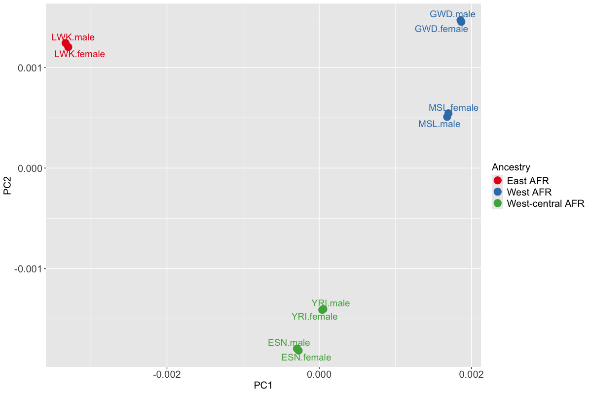

```{r, include = FALSE}
knitr::opts_chunk$set(
  collapse = TRUE,
  comment = "#>"
)
```

```{r, include = FALSE}
colorize <- function(x, color){
    if(knitr::is_latex_output()){
        sprintf("\\textcolor{%s}{%s}", color, x)
    }else if(knitr::is_html_output()){
        htmlcolor = "black"
        if(color == "blue"){
            htmlcolor = "#3182bd"
        }
        if(color == "brown"){
            htmlcolor = "#964B00"
        }
        if(color == "olive"){
            htmlcolor = "#808000"
        }
        if(color == "green"){
            htmlcolor = "#31a354"
        }
        if(color == "orange"){
            htmlcolor = "#fdbb84"
        }
        sprintf("<span style='color: %s;'>%s</span>", htmlcolor, x)
    }else x
}
```

# Introduction

The R package **envMRMEGAfm** (env-MR-MEGA fine-mapping) is designed for simultaneously fine-mapping genetic associations across multiple cohorts, allowing for multiple causal variants. This method only requires cohort-level summary statistics, the corresponding linkage disequilibrium (LD) matrices, and optionally, cohort-level environmental covariates (e.g. mean or proportion). Sometimes, we are unable to obtain LD from each cohort. In such cases, we can estimate LD structure using reference panels, such as 1000 Genomes [@10002015global], from a genetically similar population to the GWAS. This method is powerful, versatile and computationally fast in pinpointing potential causal variants while accounting for differing environmental exposures that are specific to each cohort, in addition to ancestry.

Accounting for environmental exposures that differ between cohorts and likely impact the variability of traits, the R package **envMRMEGAfm** introduces MR-MEGAfm and env-MR-MEGAfm, building upon MR-MEGA [@magi2017trans] and env-MR-MEGA [@wang2024accounting] meta-regression frameworks. In addition to the two key fine-mapping methods, **envMRMEGAfm** package also includes the method for estimating conditional and joint genetic variant effects, which was proposed in GCTA [@yang2012conditional] and the meta-analysis approaches, [MR-MEGA](https://genomics.ut.ee/en/tools/) [@magi2017trans] and [env-MR-MEGA](https://SiruRooney.github.io/env.MRmega/) [@wang2024accounting]. 

The main R functions in this package are:


1. `env_MR_MEGA_fm`:A **fine-mapping** approach applicable across multiple cohorts, with the flexibility to account for both ancestral and environmental effects (env-MR-MEGAfm) or only ancestral effects (MR-MEGAfm).

2. `MR_mega_run`: The (environment-adjusted) MR-MEGA meta-regression model.

3. `meta_sel_condest`: The approximate conditional genetic effects method.

4. `meta_sel_joinest`: The approximate joint genetic effects method.

This vignette guides readers in fine-mapping the genetic associations for a trait across multiple cohorts using MR-MEGAfm and env-MR-MEGAfm. For convenience of illustration, a simulated dataset is provided in the **envMRMEGAfm** package and details of how to run (env-)MR-MEGAfm method on your own data are explained.


# Preparation for (env-)MR-MEGAfm 

Before running the (env-)MR-MEGAfm method, several input files need to be prepared. Each input file must also include mandatory columns about genetic variants.

## Input data and format requirements

The (env-)MR-MEGAfm starts with a model with the most significant SNP in the single-SNP meta-analysis with P value below the genome-wide significant level $5\times 10^{-8}$. Therefore, it is required that the single-SNP meta-analysis are conducted by MR-MEGA [@magi2017trans] and env-MR-MEGA [@wang2024accounting]. It is noted that the meta-analysis results from both MR-MEGA and env-MR-MEGA can be obtained from `MR_mega_lrw` and `MR_mega_env_lrw`, which are wrapper functions in the **env.MRmega** R package.

For an overview of **env.MRmega** R package, see [env.MRmega](https://SiruRooney.github.io/env.MRmega/) GitHub page.


1. A list of GWAS files is required for conducting both the meta-analysis and the following fine-mapping methods. The format of each file has mandatory column headers, as in the [MR-MEGA](https://genomics.ut.ee/en/tools/) software :

 - `MARKERNAME` -  snp name 
 - `N` - sample size
 - `EAF` - effect allele frequency
 - `EA` - effect allele
 - `NEA` - non effect allele
 - `CHROMOSOME` - chromosome of marker
 - `POSITION` - position of marker
 - `BETA` - beta
 - `SE` - std.error

2. When fitting the (env-)MR-MEGA model and running (env-)MR-MEGAfm method, we need to prepare the axes of genetic variation (PCs) and the cohort-level environment exposures. If PCs are not available, `MR_mega_MDS` R function implemented in [env.MRmega](https://SiruRooney.github.io/env.MRmega/) package is used for calculating PCs by inputting the file containing all GWAS files location and the number of PCs.

3. The meta-analysis results, as the second required file, can be obtained from either [MR-MEGA](https://genomics.ut.ee/en/tools/) software or [env.MRmega](https://SiruRooney.github.io/env.MRmega/) package. The output from both approaches must contain the following columns.

- `MARKERNAME`: unique marker identification across all cohorts.

- `CHROMOSOME`: chromosome of marker.

- `POSITION`: physical position in chromosome of marker.

- `N`: sample size.

- `chisq_association`, `ndf_association` and `pvalue_association`: test of the null hypothesis of no association of each variant. `chisq_`, `ndf_` and `pvalue_` refer to chisq value, number of degrees of freedom and p-values of the corresponding test.


4. In addition to the list of GWAS files and the corresponding meta-analysis results, the (env-)MR-MEGAfm method requires the cohort-level LD correlation matrices as a third input file. When the cohort-level LD correlation is unavailable, an approximation of the LD correlation matrix based on a reference panel may be used. For each LD correlation structure, both the column names and row names correspond to `MARKERNAME`.


## Packages installation and loading

Before installing **envMRMEGAfm** package, we load the packages necessary for analysis, and check the version of each package.
```{r,eval=FALSE}
#cran
cran.pkgs <- c('data.table', 'doParallel','dplyr','foreach','parallel')

# load packages 
sapply(cran.pkgs, require, character.only = TRUE)
```

# Simulation example

In this simulated data example, we considered 5 continental African populations which were collected from Phase 3 of the 1000 Genomes Project [@10002015global]. The five populationss are coded as `r colorize("ESN","green")`, `r colorize("GWD","green")`, `r colorize("LWK","green")`, `r colorize("MSL","green")`, `r colorize("YRI","green")`. Using the genotype data from each of the five cohorts, we used [HAPGEN2](https://mathgen.stats.ox.ac.uk/genetics_software/hapgen/hapgen2.html) [@su2011hapgen2] software to generate individual-level genotype data of each cohort, with a sample size of 10,000 for each cohort. Within each population, we retained variants with MAF>0.01, regardless of whether the variant satisfies the MAF threshold in the other African populations. Under this setting, the number of retained variants differs across populations: 301 in `r colorize("ESN","green")`, 291 in `r colorize("GWD","green")`, 289 in `r colorize("LWK","green")`, 299 in `r colorize("MSL","green")` and 292 in `r colorize("YRI","green")`. Each populations is then stratified into female and male cohorts. When simulating 10 sex-stratified GWAS files for a region in chromosome19: 45711510-45770083, two randomly selected genetic variants, `r colorize("rs73939822","brown")` and `r colorize("rs60269219","brown")`, were designed as causal variants (CVs) across all cohorts. Additionally, the corresponding population-level LD correlation matrices are calculated and can be loaded from the **envMRMEGAfm** package.

Fig 1 shows that the first two axes of genetic variation from multi-dimensional scaling of the Euclidean distance matrix between 10 sex-stratified cohorts are sufficient to separate population groups from different regions of Africa: east Africa (`r colorize("LWK","green")`), west-central Africa (`r colorize("ESN","green")`,`r colorize("YRI","green")`) and west Africa (`r colorize("GWD","green")`, `r colorize("MSL","green")`).

```{r,out.width='100%',fig.align='center',fig.cap="Figure 1. Axes of genetic variation separating five continental African cohorts"}



```

Accounting for sex indicators and environmental exposures which differ across all cohorts, we introduce sex and smoking status as the two environmental covariates. Cohort-level environmental covariates are constructed by taking the mean or proportion of each individual-level covariate. Cohort-level sex and smoking covariates can be loaded using the following codes: 

```{r,eval=TRUE}
library(envMRMEGAfm)
data(sexsmk)
sexsmk
```

For simulating the (environment-adjusted) meta-analysis results, we derived two axes of genetic variation (PCs) from a subset of variant with MAF>5% in across 10 sex-stratified African cohorts. The PCs can be loaded from **envMRMEGAfm** package and are shown in the following:
```{r,eval=TRUE}
library(envMRMEGAfm)
data(pcs)
pcs
```

`r colorize("Note", "blue")`:
- If PCs are not available, `MR_mega_MDS` function implemented in [env.MRMEGA](https://SiruRooney.github.io/env.MRmega/) package is used for calculating PCs by inputting the file containing all GWAS files location and the number of PCs.


## Data pre-processing

In **envMRMEGAfm** package, R function `env_MR_MEGA_fm` is the main tool for fine-mapping genetic associations for the specified traits. Before performing the fine-mapping procedure, we need to make sure that all GWAS and LD matrices are aligned to the same reference allele. Additionally, some large-scaled LD matrices might contain redundant variants that are not present in all GWAS files. Through data pre-processing, we simplify the raw LD data by removing these redundant variants. 

In practice, since both GWAS files and LD matrices contain a large amount of genetic variants information, we need to create two input files: one for all GWAS files locations and another for LD matrices locations. The `read_gwasld` function is used for pre-processing these raw data.

```{r,eval=TRUE}
gwas.loc=c("/Volumes/Mac/Stepwise_conditioning/Codes/env-MR-MEGAfm-Rpack/g1000_5afr_Rpack/gwasfile/esn_female.txt",
           "/Volumes/Mac/Stepwise_conditioning/Codes/env-MR-MEGAfm-Rpack/g1000_5afr_Rpack/gwasfile/esn_male.txt",
           "/Volumes/Mac/Stepwise_conditioning/Codes/env-MR-MEGAfm-Rpack/g1000_5afr_Rpack/gwasfile/gwd_female.txt",
           "/Volumes/Mac/Stepwise_conditioning/Codes/env-MR-MEGAfm-Rpack/g1000_5afr_Rpack/gwasfile/gwd_male.txt",
           "/Volumes/Mac/Stepwise_conditioning/Codes/env-MR-MEGAfm-Rpack/g1000_5afr_Rpack/gwasfile/lwk_female.txt",
           "/Volumes/Mac/Stepwise_conditioning/Codes/env-MR-MEGAfm-Rpack/g1000_5afr_Rpack/gwasfile/lwk_male.txt",
           "/Volumes/Mac/Stepwise_conditioning/Codes/env-MR-MEGAfm-Rpack/g1000_5afr_Rpack/gwasfile/msl_female.txt",
           "/Volumes/Mac/Stepwise_conditioning/Codes/env-MR-MEGAfm-Rpack/g1000_5afr_Rpack/gwasfile/msl_male.txt",
           "/Volumes/Mac/Stepwise_conditioning/Codes/env-MR-MEGAfm-Rpack/g1000_5afr_Rpack/gwasfile/yri_female.txt",
           "/Volumes/Mac/Stepwise_conditioning/Codes/env-MR-MEGAfm-Rpack/g1000_5afr_Rpack/gwasfile/yri_male.txt")

ld.loc=c("/Volumes/Mac/Stepwise_conditioning/Codes/env-MR-MEGAfm-Rpack/g1000_5afr_Rpack/LD/esn.txt",
         "/Volumes/Mac/Stepwise_conditioning/Codes/env-MR-MEGAfm-Rpack/g1000_5afr_Rpack/LD/gwd.txt",
         "/Volumes/Mac/Stepwise_conditioning/Codes/env-MR-MEGAfm-Rpack/g1000_5afr_Rpack/LD/lwk.txt",
         "/Volumes/Mac/Stepwise_conditioning/Codes/env-MR-MEGAfm-Rpack/g1000_5afr_Rpack/LD/msl.txt",
         "/Volumes/Mac/Stepwise_conditioning/Codes/env-MR-MEGAfm-Rpack/g1000_5afr_Rpack/LD/yri.txt")

LD=c("esn","gwd","lwk","msl","yri")
#Each African population is stratified into male and female cohorts.
pop=c("esn.female","esn.male","gwd.female","gwd.male","lwk.female","lwk.male","msl.female","msl.male","yri.female","yri.male")

gwasld=read_gwasld(gwas.loc,ld.loc,which.ld=rep(LD,each=2),cohort_name=pop,ld_name=LD,out_loc=NULL)

gwas.list=gwasld$gwas.list

ld.list=gwasld$ld.list

```
In the commands above, `read_gwasld` function outputs two files: one containing the pre-processed GWAS files and another containing the pre-processed LD matrices. These pre-processed GWAS files and LD matrices can be loaded from the **envMRMEGAfm** package.

More specifically, the above arguments present in `read_gwasld` function are:

- `gwas.loc`: A file contains a vector of length $K_g$. Each component of the vector refers to the location of GWAS file.

- `ld.loc`: A file contains a vector of length $K_{ld}$. Each component of the vector refers to the location of LD structure files.

- `which.ld`: A character vector of length $K_g$. Each component of the vector corresponds to one LD structure. The length of which.ld should equal to the number of GWAS files. `r colorize("Note", "blue")`: the argument `which.ld` is regarded as a link between GWAS files and LD files. Each component of `which.ld` vector results from one of the LD names.  

- `cohort_name`: A character vector of length $K_g$. Each component of the vector corresponds to one GWAS file.

- `ld_name`: A character vector of length $K_{ld}$. Each component of the vector corresponds to one LD structure.

- `out_loc`: Path to save pre-processed GWAS files and LD structure. By default, `out_loc`=NULL.

- `actual.geno`: An indicator to specify whether the true cohort-level LD structure is provided. If we can obtain the real cohort-level LD structures directly or derive LD structures from the real individual-level genotype data of the involved cohorts, the argument `actual.geno` is set to `TRUE`. If we estimate LD approximation from the reference sample as a replacement, `actual.geno` is set to `FALSE`. By default `actual.geno`=FALSE.The default value is consistent for GCTA-COJO setting.

## Fine-mapping


In the simulation design where the allelic heterogeneity is correlated with smoking status, we applied env-MR-MEGAfm method and MR-MEGAfm to the simulated example respectively. Different from env-MR-MEGAfm, we run MR-MEGAfm by setting the argument `env` as `NULL`. In addition to some arguments appearing in `read_gwasld` function, there are other arguments in `env_MR_MEGA_fm` function. The additional arguments are illustrated in the following:

- `meta.file`: The meta-analysis results obtained from the output of MR-MEGA method or env-MR-MEGA method. A dataframe contains some mandatory columns where **Preparation for (env-)MR-MEGAfm** section gives the further details.

- `ncores`: The number of cores which would be used for running in parallel.

- `collinear`: A correlation threshold to filter out the target SNP in high LD with the SNP set. If the squared multiple correlation between the target SNP exceeds the threshold, such as 0.9, the target SNP is ignored.

- `pvalue_cutoff`: A p-value threshold to identify genetic associations. By default, `pvalue_cutoff`=5e-8.

- `cred.thr`: Credible threshold for the credible set for each selected potential SNP. By default, `cred.thr`=0.99 refers to 99% credible sets.

`r colorize("Note", "blue")`:

- In this simulated example, LD correlation matrix of each population was derived from the true individual-level genotype data, with the argument `actual.geno` set to `TRUE`. However, in some cases, individual-level genotype data for each cohort are poor, resulting in unavailable for calculation of LD matrices. In such cases, the LD matrix can be estimated using a reference panel (e.g. [1000 Genomes](https://ctg.cncr.nl/software/MAGMA/ref_data/)) from a genetically similar population to the samples used for genotype-phenotype association analysis. When the approximation of LD matrix is applied, argument `actual.geno` should be set to `FALSE`.

- For (env-)MR-MEGAfm method, the key model selection strategy is built upon (env-)MR-MEGA meta-analysis framework. As a result, (env-)MR-MEGAfm method has the limitations regarding the number of PCs (`r colorize("T", "blue")`) and the number of environment exposures (`r colorize("K", "blue")`). Specifically, for MR-MEGAfm, across (`r colorize("K", "blue")`) cohorts, the number of axes of genetic variation (`r colorize("T", "blue")`) is constrained by `r colorize("T<K-2", "blue")`. For env-MR-MEGAfm, the limitation extends to the sum of the number of axes of genetic variation (`r colorize("T", "blue")`) and the number of environmental covariates (`r colorize("S", "blue")`), with the limitation `r colorize("T+S<K-2", "blue")`.


**env-MR-MEGAfm**


```{r,eval=TRUE}
names(gwas.list)
names(ld.list)

######################################env-MR-MEGA fine-mapping###################################
tictoc::tic("Run env-MR-MEGA fine-mapping method")
library(doParallel)
envmetafm.out=env_MR_MEGA_fm(gwas.list,ld.list,which.ld=rep(names(ld.list),each=2),meta.file=envMRMEGAout,PCs=pcs,env=sexsmk,out_loc=NULL,ncores=2,collinear=0.9,pvalue_cutoff=5e-8,cred.thr=0.99)
tictoc::toc()
envmetafm.out

```


**MR-MEGAfm**
```{r,eval=TRUE}
######################################MR-MEGA fine-mapping###################################
tictoc::tic("Run env-MR-MEGA fine-mapping method")
library(doParallel)
metafm.out=env_MR_MEGA_fm(gwas.list,ld.list,which.ld=rep(names(ld.list),each=2),meta.file=MRMEGAout,PCs=pcs,env=NULL,out_loc=NULL,ncores=2,collinear=0.9,pvalue_cutoff=5e-8,cred.thr=0.99)
tictoc::toc()

metafm.out

```

The results from both MR-MEGAfm and env-MR-MEGAfm comprise two main parts: 

- `sel.set`: The selected potential associated SNP set.

- `tgCS.thr`: A list of the credible sets of the selected SNPs under the specified threshold. By default, the specified threshold is set to 0.99. Each component of the list is a dataframe containing the following columns:

- `MARKERNAME`: unique marker identification across all cohorts.

- `chisq_association`, `ndf_association` and `pvalue_association`: test of the null hypothesis of no association of each variant. `chisq_`, `ndf_` and `pvalue_` refer to chisq value, number of degrees of freedom and p-values of the corresponding test.

- `chisq_residual`, `ndf_residual` and `pvalue_residual`: test of residual heterogeneity.

- `logBF`: log of Bayesian Factor.

- `PPs`: Posterior probability.

- `max_ld`: The maximum of LD value between each target selected variant and the variants in the credible set.

- `cs.inc`: The indicator for determining whether the variants should be included in the credible sets based on the specified credible threshold.


For MR-MEGAfm, 

- `chisq_anc_het`, `ndf_anc_het` and `pvalue_anc_het`: test of ancestral heterogeneity.

For env-MR-MEGAfm, results contain tests which are different from MR-MEGAfm. 

- `chisq_anc_env_het`, `ndf_anc_env_het` and `pvalue_anc_env_het`: test of ancestral and environmental heterogeneity.

- `chisq_anc_het`, `ndf_anc_het` and `pvalue_anc_het`: test of allelic heterogeneity due to ancestry alone.


- `chisq_env_het`, `ndf_env_het` and `pvalue_env_het`: test of allelic heterogeneity due to environment alone.


# Reference

